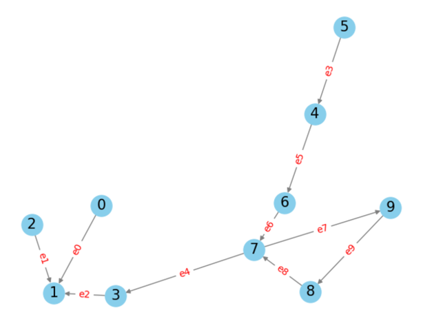
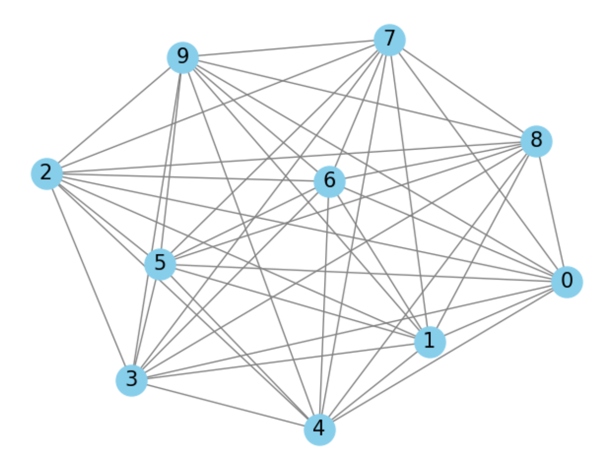
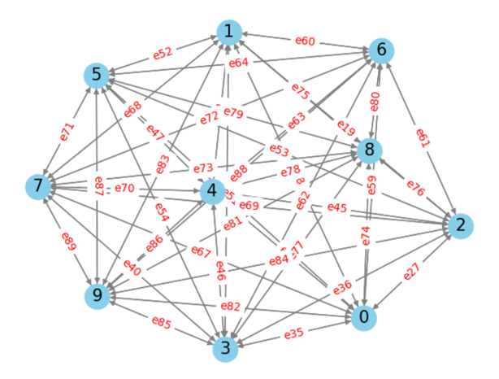

## Условие

### Задача граф - матрица на инцидентност: 

Нарисувайте на хартия един насочен ацикличен граф с 10 възела (направете снимка и приложете към заданието). Опишете графа като използвате матрица на инцидентност (в коментар напишете коефициентите, които ще използвате за матрицата). Напишете алгоритъм, който свежда графа до напълно свързан, като извеждате новите връзки във формат (начален възел, краен възел).

### Решение

```py
import numpy as np

class Graph:
    def __init__(self, num_nodes, num_edges):
        self.matrix_of_incidence = np.zeros((num_nodes, num_edges), "int")
        self.nodes = num_nodes

    def add_edge(self, edges: list):
        for i in range(len(edges)):
            self.matrix_of_incidence[edges[i][0]][i] = 1
            self.matrix_of_incidence[edges[i][1]][i] = -1

    def fully_connected_graph(self, edges):
        temp_edges = edges.copy()
        print("Нови възли:")
        for i in range(self.nodes):
            for j in range(self.nodes):
                if i != j and [i, j] not in temp_edges:
                        temp_edges.append([i, j])
                        print([i, j], end=" ")
            print()
        print()

        temp1_edges = temp_edges.copy()
        for i in range(len(temp_edges)):
            for j in range(len(temp_edges)):
                if i == j and [i,j] in temp1_edges:
                    temp1_edges.remove([i, j])
```

### Примерно решение:

```py
edges = [[0, 1], [2, 1], [3, 1], [5, 4], [7, 3], [4, 6], [6, 7], [7, 9], [8, 7], [9, 8]]
graph = Graph(10, len(edges))
graph.add_edge(edges)

graph.fully_connected_graph(edges)
```

### Резултат:
```
Нови възли:
[0, 2] [0, 3] [0, 4] [0, 5] [0, 6] [0, 7] [0, 8] [0, 9] 
[1, 0] [1, 2] [1, 3] [1, 4] [1, 5] [1, 6] [1, 7] [1, 8] [1, 9] 
[2, 0] [2, 3] [2, 4] [2, 5] [2, 6] [2, 7] [2, 8] [2, 9] 
[3, 0] [3, 2] [3, 4] [3, 5] [3, 6] [3, 7] [3, 8] [3, 9] 
[4, 0] [4, 1] [4, 2] [4, 3] [4, 5] [4, 7] [4, 8] [4, 9] 
[5, 0] [5, 1] [5, 2] [5, 3] [5, 6] [5, 7] [5, 8] [5, 9] 
[6, 0] [6, 1] [6, 2] [6, 3] [6, 4] [6, 5] [6, 8] [6, 9] 
[7, 0] [7, 1] [7, 2] [7, 4] [7, 5] [7, 6] [7, 8] 
[8, 0] [8, 1] [8, 2] [8, 3] [8, 4] [8, 5] [8, 6] [8, 9] 
[9, 0] [9, 1] [9, 2] [9, 3] [9, 4] [9, 5] [9, 6] [9, 7] 
```

### Визуализация на напълно свързания граф:


