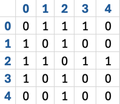
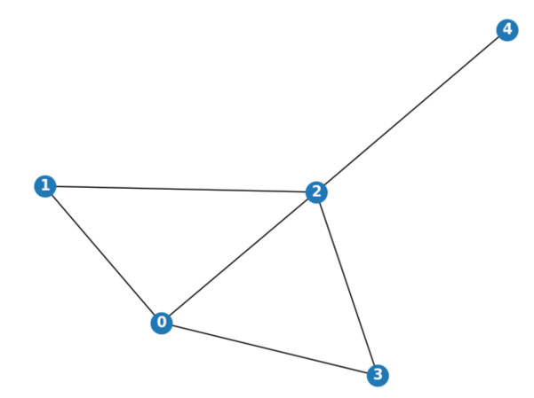
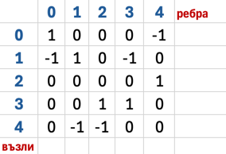
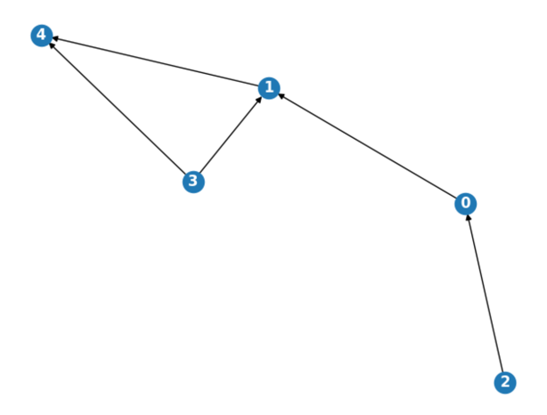

# Граф - имплементация

## 1. Свързан списък

### Код с подробни коментари 
```py
# клас AdjNode - служи за конструиране на свързания списък
class AdjNode:
    def __init__(self, value):
        self.vertex = value
        self.next = None

# клас  Graph - създаване на граф
class Graph:
    # инициализиране на празен списък с дължнина size, чийто елементи са None
    def __init__(self, size):
        self.size = size
        self.graph = [None] * self.size
        
    # конструиране на граф чрез създаване на ребро между два възела - source и destination    
    def add_edge(self, source, destination):
        # при ориентиран граф: source -> destination
        node = AdjNode(destination) # node: vertex = destination, next = None
        node.next = self.graph[source] # next приема стойността, която стои на source позицията в списъка
        self.graph[source] = node # source позицията в списъка вече съдържа обект с атрибути vertex = destination и next = предишната стойност на тази позиция 

        # ако графът е неориентиран, използваме и следващите редове, като destination -> source
        node = AdjNode(source)
        node.next = self.graph[destination]
        self.graph[destination] = node

    def print_graph(self):
        # обхождаме всеки един от елементите на graph
        for i in range(self.size):
            print(f"Възел {i}:", end="")
            temp = self.graph[i] # съхраняваме във временна променлива стойността на i-тия елемент от графа (очаква се там да има свързан списък, иначе стои None)
            
            # обхождаме свързания списък, докато достигнем стойност None
            while temp:
                print(f" -> {temp.vertex}", end="") # извеждане на елемента
                temp = temp.next # взимане на следващия елемент от свързания списък, съхранен на i-тата позиция в графа
            print("")
```

> _**Препоръка:**_ Използвайте дебъгера, за да проследите процеса на съхранение на данните в избраната структура.

### Примерен тест:
```py
graph = Graph(5)

graph.add_edge(0,1)
graph.add_edge(0,2)
graph.add_edge(0,3)
graph.add_edge(1,2)

graph.print_graph()
```

### Резултат:
```
Възел 0: -> 3 -> 2 -> 1
Възел 1: -> 2 -> 0
Възел 2: -> 1 -> 0
Възел 3: -> 0
Възел 4:
```

### Код в чист вид
```py
class AdjNode:
    def __init__(self, value):
        self.vertex = value
        self.next = None

class Graph:
    def __init__(self, size):
        self.size = size
        self.graph = [None] * self.size
            
    def add_edge(self, source, destination):
        node = AdjNode(destination)
        node.next = self.graph[source]
        self.graph[source] = node 

        node = AdjNode(source)
        node.next = self.graph[destination]
        self.graph[destination] = node

    # извеждане на графа в конзолата
    def print_graph(self):
        for i in range(self.size):
            print(f"Възел {i}:", end="")
            
            temp = self.graph[i]
            while temp:
                print(f" -> {temp.vertex}", end="")
                temp = temp.next
            
            print("")
```

## 2. Матрица на съседство
* 1 - има ребро между два възела
* 0 - няма връзка между два възела


### Код с подробни коментари
```py
import numpy as np

class Graph:
    
    # създаване на матрица от нули с размерност size x size
    def __init__(self, size):
        self.adjMatrix = np.zeros((size, size), "int")

    # създаване на ребро между два възела - чрез добавяне на 1 (ако графът е претеглен - добавяне на теглото)
    def add_edge(self, vertex1, vertex2):
        self.adjMatrix[vertex1][vertex2] += 1
        self.adjMatrix[vertex2][vertex1] += 1
```
### Примерен тест:

```py
graph = Graph(5)

graph.add_edge(0, 1)
graph.add_edge(0, 2)
graph.add_edge(0, 3)
graph.add_edge(1, 2)
graph.add_edge(2, 3)
graph.add_edge(2, 4)

print(graph.adjMatrix)
```
### Резултат:
```
[[0 1 1 1 0]
 [1 0 1 0 0]
 [1 1 0 1 1]
 [1 0 1 0 0]
 [0 0 1 0 0]]
```

### Код в чист вид:
```pycon
import numpy as np

class Graph:
    def __init__(self, size):
        self.adjMatrix = np.zeros((size, size), "int")

    def add_edge(self, vertex1, vertex2):
        self.adjMatrix[vertex1][vertex2] += 1
        self.adjMatrix[vertex2][vertex1] += 1
```
## 3. Матрица на инцидентност

* 1 - ребро излиза от възел
* -1 - ребро влиза във възел
* 0 - няма връзка между ребро и възел
* редовете в таблицата представляват възлите, а колоните - ребрата

### Код с подробни коментари
```pycon
import numpy as np

class Graph:
    # създаване на матрица с размери nodes x edges
    def __init__(self, nodes, edges):
        self.matrix_of_incidence = np.zeros((nodes, edges), "int")
    
    # при подаден списък с двойки свързани помежду си възли
    # добавяме или изваждаме 1 към матрицата, 
    # базирайки се на горепосоченото правило
    def add_edges(self, edges: list):
        for i in range(len(edges)):
            self.matrix_of_incidence[edges[i][0]][i] += 1
            self.matrix_of_incidence[edges[i][1]][i] -= 1
```
### Примерен тест:

> _**Забележка:**_ Върху изображението не са посочени номерата на ребрата. Те са следните: 
<br> ребро 0: 0 --> 1
<br> ребро 1: 1 --> 4
<br>ребро 2: 3 --> 4
<br>ребро 3: 3 --> 1
<br>ребро 4: 2 --> 0


```pycon
graph = Graph(5,5)
edges = [(0,1), (1,4), (3,4),(3,1), (2,0)]
graph.add_edges(edges)
print(graph.matrix_of_incidence)
```
### Резултат:
```
[[ 1  0  0  0 -1]
 [-1  1  0 -1  0]
 [ 0  0  0  0  1]
 [ 0  0  1  1  0]
 [ 0 -1 -1  0  0]]
```

### Код в чист вид
```pycon
import numpy as np

class Graph:
    def __init__(self, nodes, edges):
        self.matrix_of_incidence = np.zeros((nodes, edges), "int")

    def add_edges(self, edges: list):
        for i in range(len(edges)):
            self.matrix_of_incidence[edges[i][0]][i] += 1
            self.matrix_of_incidence[edges[i][1]][i] -= 1
```