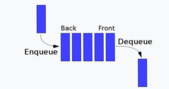

# Опашка


* линейна структура от данни
* **_FIFO_** (First In First Out)
* реализация в Python - чрез списък, чрез deque
* основни операции:
  * **enqueue(element)** - добавя елемент към опашката (тоест в най-ляво)
  * **front()** - връща първият добавен елемент в опашката
  * **dequeue()** - изважда 1-ят добавен елемент от опашката и го връща (тоест най-десния елемент)
  * **rear()** - връща последния добавен елемент в опашката
  * **isEmpty()** - връща True ако няма елементи, иначе False

## 1. Реализация чрез списък
```py
class Queue:
    def __init__(self):
        self.que = []
        
    def isEmpty(self):
        return self.que == []
    
    def enqueue(self, item):
        self.que.insert(0,item)
        
    def dequeue(self):
        return self.que.pop()
    
    def rear(self):
        return self.que[-1]
    
    def front(self):
        return self.que[0]
```

## 2. Реализация чрез deque
* deque = double queue (лесен достъп на първи и последен елемент с по-малка сложност спрямо списъка)
```py
from collections import deque
    
class Queue:
    def __init__(self):
        self.que = deque()

    def isEmpty(self):
        return self.que == deque()

    def enqueue(self, item):
        self.que.append(item)

    def dequeue(self):
        return self.que.popleft()

    def peek(self):
        last_elem = self.que.popleft()
        self.que.appendleft(last_elem)
        return last_elem
```